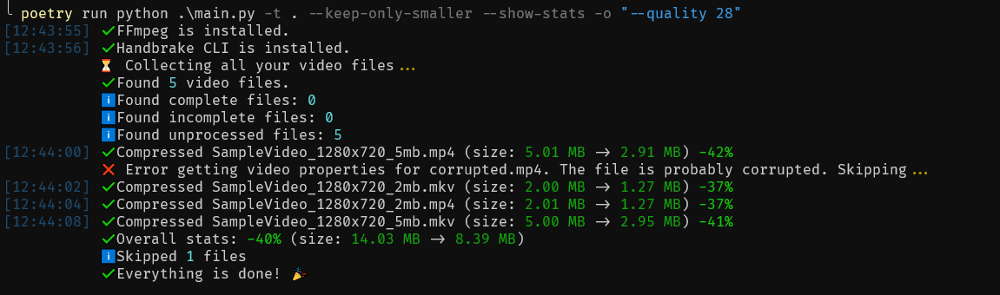
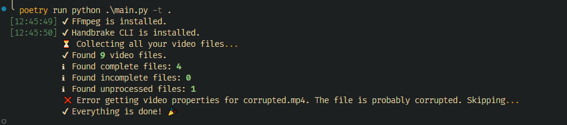

<p align="center">
    
</p>

# 🖥️ HandbrakeCLI Batch Compressor

Welcome to the **Video Compressor** project! 

This application uses the **HandbrakeCLI** tool to compress video files in bulk. 


## 📑 Table of Contents
- [🖥️ HandbrakeCLI Batch Compressor](#️-handbrakecli-batch-compressor)
  - [📑 Table of Contents](#-table-of-contents)
  - [🧐 Introduction](#-introduction)
  - [✨ Features](#-features)
  - [📸 Screenshots](#-screenshots)
  - [🛠️ Installation](#️-installation)
  - [🚀 Usage](#-usage)
    - [📦 Basic Usage](#-basic-usage)
    - [⚙️ Advanced Usage](#️-advanced-usage)
    - [🎨 Examples](#-examples)
  - [🧠 Smart Filters](#-smart-filters)
  - [⚙️ Options \& Flags](#️-options--flags)
  - [📜 License](#-license)

## 🧐 Introduction

This application is designed to **compress video files** in bulk using the **HandbrakeCLI**.
It offers many [features](#-features) to customize the compression process such as
deletion of original files, show statistics during and after the compression, etc.


## ✨ Features

- **Bulk Compression**: Compress multiple video files at once using HandbrakeCLI.
- **Custom Compression Options**: Pass any options available in HandbrakeCLI, like encoders and quality settings.
- **File Management**: Automatically detect compressed and incomplete files if your process is interrupted.
- **Filter Features**: Smart filters allow skipping videos that don't meet your criteria (e.g., resolution, bitrate, or frame rate).
- **Statistics**: Optionally display compression stats during and after the process.
- **Replace Original Files**: Automatically delete original files if they are successfully compressed.

## 📸 Screenshots




## 🛠️ Installation

**TODO**: *ready-to-run builds to run on your machine*

1. Clone this repository:
   ```bash
   git clone https://github.com/Glitchy-Sheep/handbrake-batch-compressor.git
   ```
2. Install poetry:
   ```bash
   curl -sSL https://install.python-poetry.org | python3 -
   ```

3. Install dependencies:
   ```bash
   poetry install --no-root
   ```

4. Run the application:
   ```bash
   poetry run python main.py --help
   ```


## 🚀 Usage

### 📦 Basic Usage

To start compressing your videos, just run the application with the following command:

```bash
python main.py --target-path ./videos -o "<any handbrakecli option>"
```

This will process all the video files in the `./videos` directory.

### ⚙️ Advanced Usage

You can specify more options such as HandbrakeCLI settings, file extensions, and whether to delete the originals after processing.

```bash
python main.py -t ./videos -o "--encoder x264 --quality 20" \
    --progress-extension c \
    --complete-extension x \
    --show-stats \
    --keep-only-smaller \
    --delete-original-files # will delete originals after processing
```

### 🎨 Examples

<details>
    <summary> 
    <p style="color: #0066ff; font-weight: bold; cursor: pointer">[Expand for examples]<p>
    </summary>

1. **Compress all videos in a directory and delete the originals:**
   ```bash
   python main.py -t ./videos -d
   ```

2. **Compress videos with a custom encoder and quality:**
   ```bash
   python main.py -t ./videos -o "--encoder qsv_h264 --quality 20"
   ```

3. **Use a preset for compression (e.g., "Fast 720p30"):**
   ```bash
   python main.py -t ./videos -o "--preset 'Fast 720p30'"
   ```

4. **Compress videos and only keep those smaller than the original:**
   ```bash
   python main.py -t ./videos -k -s
   ```

5. **Skip videos with lower resolution and bitrate than specified:**
   ```bash
   python main.py -t ./videos --filter-min-resolution 720x480 --filter-min-bitrate 100
   ```
</details>

## 🧠 Smart Filters

Smart filters allow you to apply conditions that control which videos will be processed based on their characteristics.

- **Minimum Bitrate**: Skips videos with a bitrate lower than the specified value.
- **Minimum Frame Rate**: Skips videos with a frame rate lower than the specified value.
- **Minimum Resolution**: Skips videos with a resolution lower than the specified threshold.

These filters help avoid unnecessary processing of low-quality videos.

## ⚙️ Options & Flags

Here are the available options you can use when running the application:

| Option                          | Description                                                                   |
| ------------------------------- | ----------------------------------------------------------------------------- |
| `--target-path`, `-t`           | The directory containing the videos you want to compress.                     |
| `--handbrakecli-options`, `-o`  | Custom options to pass to HandbrakeCLI (e.g., encoder, quality settings).     |
| `--progress-extension`, `-p`    | The extension to append to files while they are being processed.              |
| `--complete-extension`, `-c`    | The extension to append to files once processing is complete.                 |
| `--show-stats`, `-s`            | Display statistics during and after the compression process.                  |
| `--delete-original-files`, `-d` | Delete original files after successful compression.                           |
| `--filter-min-bitrate`, `-b`    | Skip videos with a bitrate lower than the specified value (in kbytes).        |
| `--filter-min-frame-rate`, `-f` | Skip videos with a frame rate lower than the specified value.                 |
| `--filter-min-resolution`, `-r` | Skip videos with a resolution lower than the specified value (e.g., 720x480). |
| `--keep-only-smaller`, `-k`     | Keep only videos that are smaller than the original ones after compression.   |
| `--guide`, `-g`                 | Show a guide for using the application and exit.                              |


## 📜 License

This project is licensed under the MIT License - see the [LICENSE](LICENSE) file for details.
